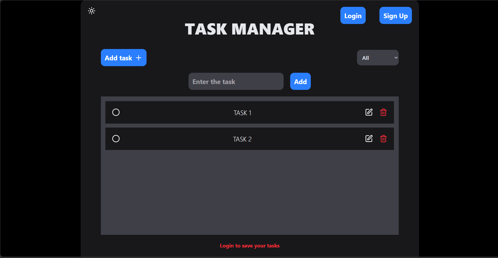
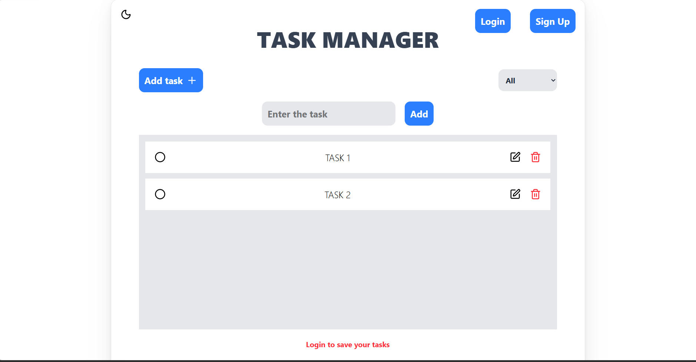
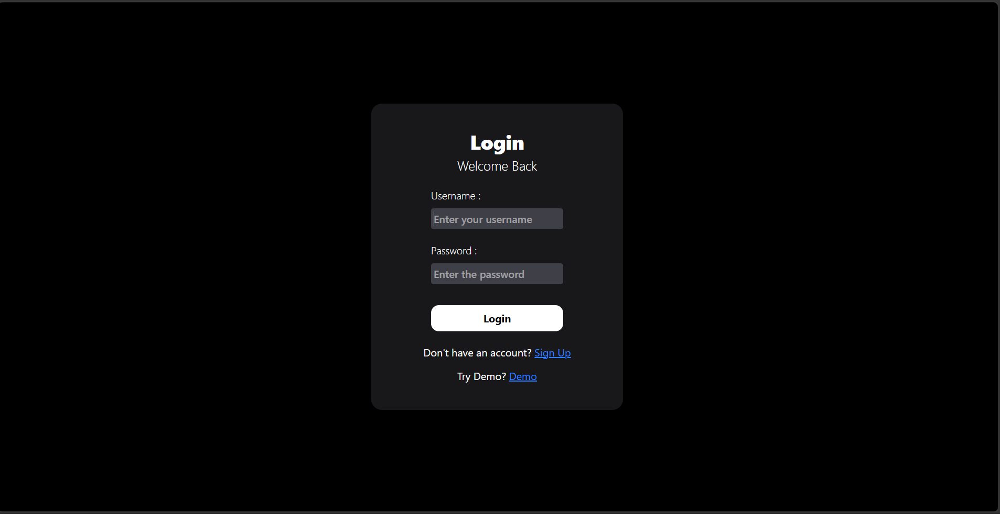
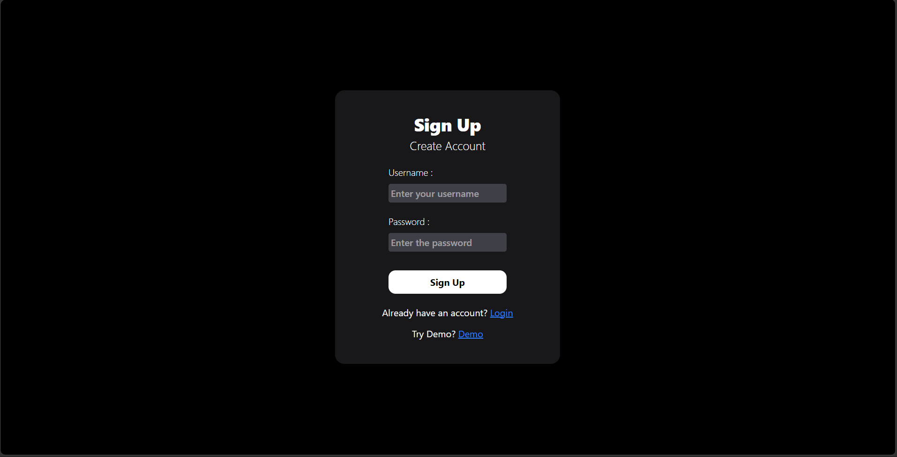

# Task Manager App

A full-stack task manager app built with the MERN stack that allows authenticated users to manage their tasks with persistent storage in MongoDB while also supporting temporary guest mode.

## Live Demo

**Task Manager** : https://react-task-manager-blond.vercel.app/


## Features

### Authentication
- User Login and Signup
- JWT Authentication
- Protected Routes
- Secure password hashing using bcrypt

### Task Management
- Create Tasks
- View Tasks
- Delete Tasks
- Mark Tasks as Complete/Pending
- Filter Tasks (All, Completed, Pending)

### Guest Mode
- Use the app without logging in
- Add/Edit/Delete/Complete tasks
- Tasks are stored temporarily in memory
- Guest tasks disappear after page refresh

## UI Features
- Responsive Design
- Dark / Light Theme
- Modern UI built with Tailwind CSS
- Mobile Friendly


## Tech Stack

### Frontend
- React
- Vite
- Tailwind CSS
- Axios
- React Router
- Lucide React

### Backend
- Node.js
- Express.js
- MongoDB
- Mongoose
- JWT
- bcrypt


## Project Structure

```text
task-manager-app/
│
├── client/
│   └── public/
│   └── src/
│       └── assets/
│       └── pages/
│       └── ...
│
├── server/
│   ├── middleware/
│   ├── model/
│   ├── routes/
│   └── ...
│
└── README.md

```

## Environment Variables

### Backend (.env)

```env
PORT=5000
MONGO_URI=your_mongodb_connection_string
JWT_SECRET=your_secret_key
```

### Frontend (.env)

```env
VITE_API_URL=http://localhost:5000
```


##  Installation

### Clone Repository

```bash
git clone https://github.com/yourusername/task-manager.git
```

### Backend

```bash
cd server

npm install

npm start
```

### Frontend

```bash
cd client

npm install

npm run dev
```

## API Endpoints

### Authentication

| Method | Endpoint | Description |
|---------|----------|-------------|
| POST | `/api/auth/signup` | Register User |
| POST | `/api/auth/login` | Login User |

### Tasks

| Method | Endpoint | Description |
|---------|----------|-------------|
| GET | `/api/tasks` | Fetch All Tasks |
| POST | `/api/tasks/add` | Add Task |
| PUT | `/api/tasks/:id` | Edit Task |
| PATCH | `/api/tasks/:id` | Toggle Completion |
| DELETE | `/api/tasks/:id` | Delete Task |


## Screenshot






## Deployment

Frontend is deployed on **Vercel**.

Backend is deployed on **Render**.

> **Note:** Since the backend is hosted on Render's free tier, the first request may take a few seconds.


## Support

If you like this project, consider giving it a ⭐ on GitHub!